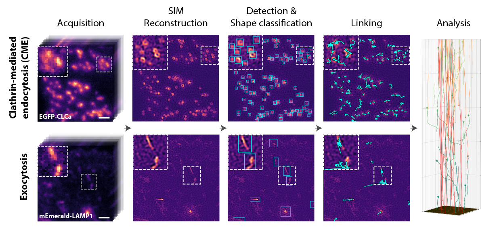
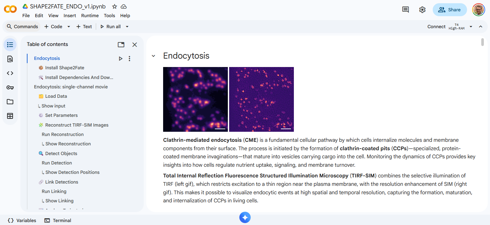
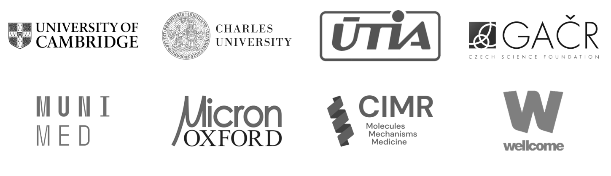

<div align="center">
  

<h1>Shape2Fate</h1>
<p><strong>A morphology-aware deep learning framework for tracking endocytic and exocytic carriers at nanoscale.</strong></p>


<p>
<a href="https://shape2fate.utia.cas.cz/"></a>
<a href="https://shape2fate.utia.cas.cz/dataset"></a>
<a href="https://www.biorxiv.org/content/10.64898/2026.03.29.715120v1"></a>

</p>
</div>

## Table of contents
- [Overview](#overview)
  - [Abstract](#abstract)
  - [Associated paper](#associated-paper)
  - [Key capabilities](#key-capabilities)
- [Quick start](#quick-start)
  - [Try in Colab](#try-in-colab)
  - [Install locally](#install-locally)
- [Repository tour](#repository-tour)
- [Model Zoo](#model-zoo)
- [Datasets](#datasets)
- [How to cite](#how-to-cite)
- [Contact](#contact)


## Overview

### Abstract
Plasma membrane homeostasis depends on balanced exocytosis and endocytosis, yet their spatiotemporal coordination has been difficult to resolve at the single-event level. We present Shape2Fate, a fully automated, shape-aware deep-learning pipeline that detects, tracks, and classifies individual exocytic and endocytic carriers in live-cell total internal reflection fluorescence structured illumination microscopy (TIRF-SIM) movies at ~100 nm resolution. Rather than relying on intensity, Shape2Fate exploits carrier morphology to classify cargo-delivery outcomes from shape evolution. Trained entirely on realistic synthetic data requiring no manual annotation, Shape2Fate reaches expert-level tracking accuracy across microscope platforms and cell types. Applying Shape2Fate to synchronized RUSH exocytosis and insulin-stimulated GLUT4 trafficking in adipocytes, we uncover an inverse coupling hierarchy: RUSH fusion nucleates de novo clathrin-coated pits (CCPs), whereas adipocyte exocytic carriers target pre-existing CCPs for rapid cargo capture. As an open-source framework, Shape2Fate yields quantitative, event-level maps of exo–endocytic coordination, enabling mechanistic dissection across cell types and pathways.

🔬 TIRF-SIM → 🧩 Reconstruction → 🎯 Detection → 🔗 Linking → 🧭 Analysis → 📊 Metrics

### Associated paper
Harmanec, A., Dagg, A.D., Kamenicky, J., Kerepecky, T., Makieieva, Y., Pereira, M.C., Bright, N., Menon, D., Gerschlick, D., Vaskovicova, N., Lai, T., Fazakerley, D., Schermelleh, L., Sroubek, F., & Kadlecova, Z. (2026). Shape2Fate: a morphology-aware deep learning framework for tracking endocytic and exocytic carriers at nanoscale. *bioRxiv*. [doi:10.64898/2026.03.29.715120](https://www.biorxiv.org/content/10.64898/2026.03.29.715120v1)

### Key capabilities
- Structured illumination microscopy (SIM) reconstruction with automatic parameter estimation and optional GPU acceleration.
- Shape-aware detection, tracking, and outcome classification for endocytic and exocytic carriers in TIRF-SIM time series.
- Ready-to-run examples that mirror the validation experiments, producing reconstructed movies, detections, trajectories, and summary metrics.

## Quick start
### Try in Colab
<div align="center">
  
</div>
<br />

Jump straight into the workflows in your browser, each notebook is preloaded with example data and the necessary dependencies:
- <a href="https://shape2fate.utia.cas.cz/colab-endocytosis/"></a> Reconstruct, detect, and track endocytic events in TIRF-SIM data.
- <a href="https://shape2fate.utia.cas.cz/colab-exocytosis/"></a> Reconstruct, detect, and track exocytic events in TIRF-SIM data.
- <a href="https://shape2fate.utia.cas.cz/colab-detector/"></a> Train a custom detector for clathrin-coated pits.

### Install locally

1. Requirements

   Before installing shape2fate, make sure you have:

   * Python 3.10–3.12 ‼️
   * Git installed on your system
   * (Optional) A CUDA-capable GPU for GPU acceleration

2. Clone the repository

   ```bash
   git clone https://github.com/harmanea/shape2fate.git
   cd shape2fate
   ```

3. (Optional) Create and activate a virtual environment

   ```bash
   python -m venv .venv
   source .venv/bin/activate   # On Windows: .venv\Scripts\activate
   ```

4. Install the package

   ```bash
   pip install .
   ```

   To include optional I/O dependencies for reading various microscopy image formats, use:

   ```bash
   pip install .[io]
   ```

   **NOTE:** Optional dependencies are required to run the example and benchmarking scripts.

5. Run a quick test

   ```bash
   python -c "import shape2fate; print(shape2fate.__version__)"
   ```

   If the installation was successful, this command will print a Shape2Fate version number such as: `0.1.0`

6. (Optional) Run a SIM reconstruction example

   ```bash
   python examples/reconstruction_example.py
   ```

   This will:

   * download an example **raw TIRF-SIM endocytosis dataset**,
   * estimate the SIM illumination parameters (frequency, angle, phase, amplitude),
   * run the full SIM reconstruction pipeline (CPU or GPU, depending on availability), and
   * save the outputs into `./data`:

     * `reconstruction.tiff` – the reconstructed TIRF-SIM time series

7. (Optional) Reproduce the tracking results from the paper

   ```bash
   python examples/tracking_example.py
   ```

   This will:

   * download the **validation dataset used in the manuscript**,
   * run the full detection → linking → evaluation pipeline on the example TIRF-SIM movie, and
   * save the outputs into `./data`:

     * `detections.csv` – per-frame CCP detections
     * `trajectories.csv` – linked trajectories after untangling and filtering
     * `metrics.txt` – summary tracking metrics (MOTA, HOTA, μTIOU, …)

    The script will also print a summary of the tracking metrics to verify the reproduction of the performance reported in the paper.

## Repository tour
- `shape2fate/` — core package implementing SIM reconstruction, detection, tracking, metrics, and synthetic-data utilities.
  - `otf.py` — optical transfer function builders and utilities for reconstruction.
  - `parameters.py` — acquisition, reconstruction and linking parameter containers with defaults.
  - `parameter_estimation.py` — automatic estimation of SIM shifts, phases, amplitudes, and frequencies from raw data.
  - `reconstruction.py` — CPU/GPU reconstruction pipeline with preprocessing, padding, filtering, and OTF mapping.
  - `detection.py` — shape-aware exocytosis/endocytosis detection routines and post-processing.
  - `models.py` — deep-learning architectures (detector and classifier) used for training and inference.
  - `linking.py` — trajectory assembly, untangling, and configurable linking.
  - `metrics.py` — trajectory-level evaluation metrics (MOTA, HOTA, μTIOU).
  - `synthetic_data.py` — generators for realistic synthetic TIRF-SIM training images and labels.
  - `utils.py` — utilities for opening and saving microscopy image files across multiple formats.
  - `sim.py` — SIM illumination geometry helpers (diffraction limits, illumination patterns, separation matrices).
- `examples/` — runnable scripts that download sample datasets and reproduce the reconstruction and tracking pipelines from the paper.
  - `reconstruction_example.py` — full SIM reconstruction demo with automatic parameter estimation.
  - `tracking_example.py` — detection, linking, and metrics reporting demo.
- `assets/` — static images used in the README and other documentation.
- `pyproject.toml` — package metadata and dependencies.

## Model Zoo
Pretrained model checkpoints for all Shape2Fate pipeline stages are available in the [`model_zoo/`](model_zoo/) directory. Each checkpoint can be loaded directly with PyTorch for inference or fine-tuning.

| Checkpoint | Architecture | Task |
|---|---|---|
| [`ccp-detector`](model_zoo/ccp-detector-sandy-wildflower-269.pt) | UNet | Endocytosis — CCP detection |
| [`ccp-detector-adipocyte`](model_zoo/ccp-detector-sandy-feather-310.pt) | UNet | Endocytosis — adipocyte CCP detection |
| [`exo-detector`](model_zoo/exo-detector-rural-wind-13.pt) | UNet (2-ch) | Exocytosis — RUSH carrier detection |
| [`exo-fusion-detector`](model_zoo/exo-fusion-detector-giddy-yogurt-32.pt) | TransformerModel | Exocytosis — fusion productivity classification |

For full details on each model (architecture parameters, usage examples, and training data), see the **[Model Zoo documentation](model_zoo/MODEL_ZOO.md)**.

## Datasets
Curated training, validation, and demo datasets are now publicly available on <a href="https://shape2fate.utia.cas.cz/dataset">Zenodo</a>:

<a href="https://shape2fate.utia.cas.cz/dataset"></a>

## How to cite
If you use Shape2Fate in your research, please cite:
```
```
@article{harmanec2026shape2fate,
  title={Shape2Fate: a morphology-aware deep learning framework for tracking endocytic and exocytic carriers at nanoscale},
  author={Harmanec, Adam and Dagg, Alexander D and Kamenicky, Jan and Kerepecky, Tomas and Makieieva, Yelyzaveta and Pereira, Maria da Concei{\c{c}}{\~a}o and Bright, Nicholas and Menon, Dilip and Gerschlick, David and Vaskovicova, Nadezda and Lai, Tiffany and Fazakerley, Daniel and Schermelleh, Lothar and Sroubek, Filip and Kadlecova, Zuzana},
  journal={bioRxiv},
  year={2026},
  doi={10.64898/2026.03.29.715120}
}

## Contact
Questions or feedback? Reach out at **shape2fate@utia.cas.cz**.

<div align="center">
  <sub>
    
  </sub>
</div>
